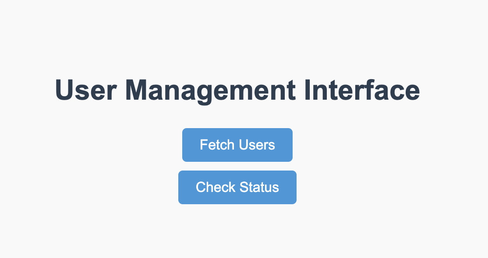
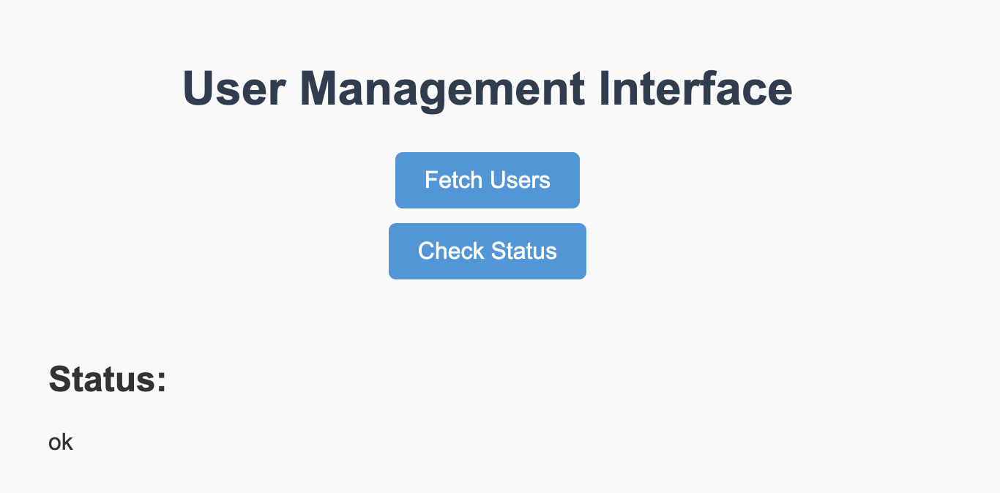
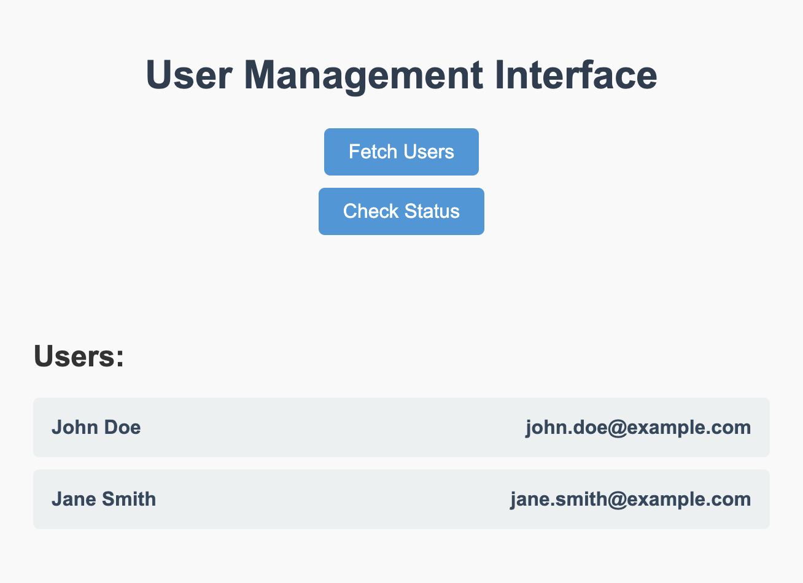

# Node.js and MySQL Docker Application with HTML Frontend

This repository contains the Node.js application with a MySQL database, both containerised using Docker. The application includes a backend API and a simple HTML frontend that allows users to interact with the API through a web interface. The frontend is served on the root route (/) and provides buttons to check the application status and retrieve a list of users from the database.

# Prerequisites

- Docker installed and running on your machine.
- Docker Compose installed on your machine.

## How it Works

### Serving the HTML Frontend

The HTML file (index.html) is served at the root route (/) of the Node.js application. When a user navigates to http://localhost, the server responds by serving this HTML file, which is a simple user interface for interacting with the backend.



### Button Interactions

**Check Status**: This button sends a GET request to the /api/status endpoint. The backend responds with a JSON object containing the status of the application (e.g., { "status": "ok" }). The response is then displayed on the webpage.



**Get Users**: This button sends a GET request to the /api/users endpoint. The backend queries the MySQL database for all users in the users table and returns the data as a JSON array. This list of users is then dynamically displayed on the webpage.



# Setup and Usage

## 1 Clone the repository 

```sh
git clone xx
cd xx
```

## 2 Configure Environment Variables

This project uses a `.env` file to manage environment variables. Create a `.env` file in the root directory of the project with the following content:

```
# MySQL Environment Variables
MYSQL_ROOT_PASSWORD=rootpassword
MYSQL_DATABASE=myapp_db
MYSQL_USER=myapp_user
MYSQL_PASSWORD=myapp_password

# Node.js Application Environment Variables
DB_HOST=mysql
DB_USER=myapp_user
DB_PASSWORD=myapp_password
DB_NAME=myapp_db
PORT=3000
```

These variables will be used by Docker Compose to configure both the MySQL and Node.js containers.

## 3 Build and Run the Containers

Use Docker Compose to build and start the application and database containers:

```sh
docker-compose up --build
```

### This command will:

- Build the Node.js application image.
- Pull the MySQL image (if not already available).
- Start the containers and link them together within the same network

## 4 Interact with the Application

Once the containers are running, the application will be available on `http://localhost:80`.

### Access the HTML Frontend

Navigate to `http://localhost:80` in your browser. You should see a simple HTML page with two buttons:

Check Status: Sends a request to /api/status.
Get Users: Sends a request to /api/users.


### What Happens When the Buttons Are Pressed?

**Check Status**: When the "Check Status" button is pressed, it triggers a request to the /api/status endpoint. The response is displayed on the page, indicating whether the application is running correctly.

**Get Users**: When the "Get Users" button is pressed, it triggers a request to the /api/users endpoint. The response, which includes a list of users from the MySQL database, is displayed on the page.

## 5 Preloaded Database

The MySQL container is preloaded with data using the `init.sql` file located in the repository. This file creates a users table and inserts some initial records.

## 6 Stopping the Containers

To stop the running containers, use the following command:

```sh
docker-compose down
```

This will stop and remove the containers, but the MySQL data will be preserved in the Docker volume.


## 7 Accessing MySQL

To access the MySQL database directly, you can use the following command:

```sh
docker exec -it mysql_db mysql -u${MYSQL_USER} -p${MYSQL_PASSWORD} -D${MYSQL_DATABASE}
```

## 8 Troubleshooting

- **Container Won't Start**: Ensure that the ports 80 and 3306 are not already in use by another application.

- **Database Connection Issues**: Ensure the environment variables in the .env file match the expected values in the Node.js application.

- **Application Not Responding**: Ensure the Node.js server is running correctly and is connected to the MySQL database.
